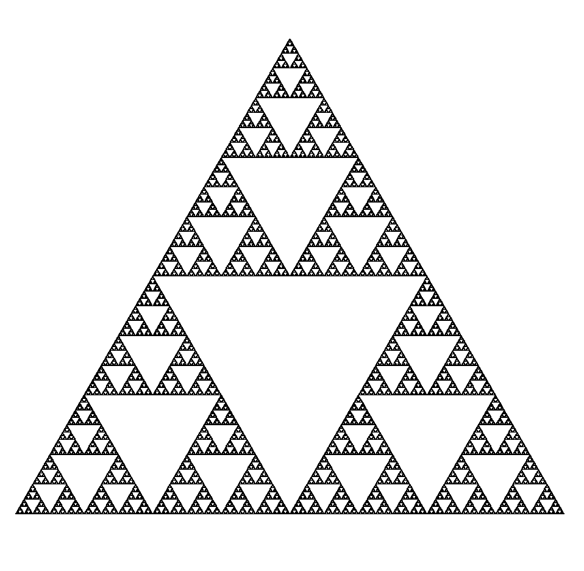
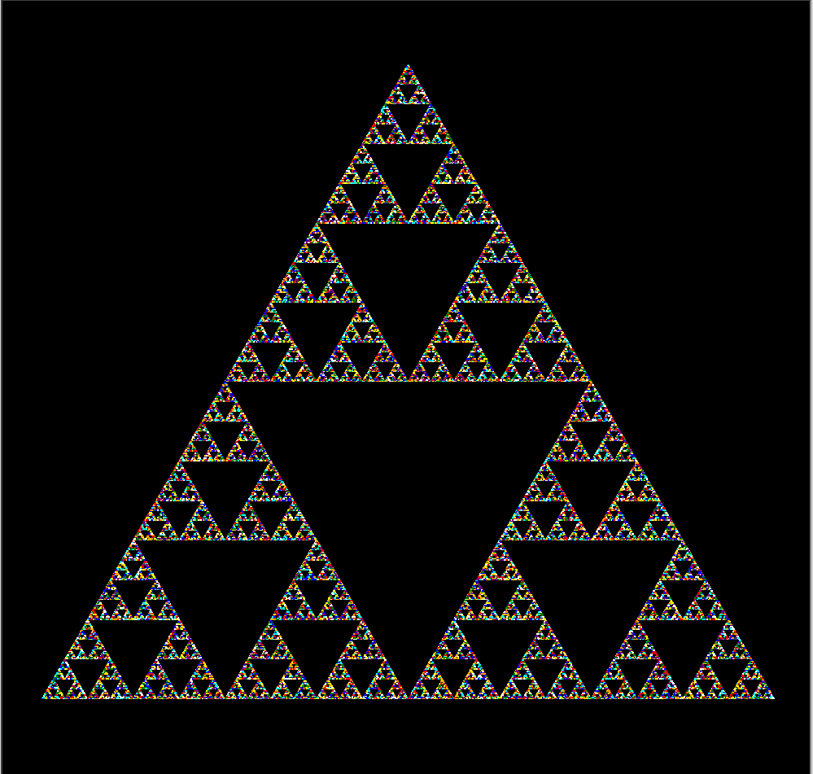

# Sierpinski Triangle with turtle graphics  
> A project made for fun  
> A simple python program that allows you to create a Sierpinski triangle fractal using a recursive definition and turtle graphics
## Requierements (python packages)
- math
- random
- turtle 
- tkinter
All of them are in the standard library, but sometimes one (mostly tkinter) might not be installed.

## Sierpinski Triangle
> The Sierpinski triangle is a fractal attractive fixed set with the overall shape of an equilateral triangle, subdivided recursively into smaller equilateral triangles. Originally constructed as a curve, this is one of the basic examples of self-similar sets—that is, it is a mathematically generated pattern that is reproducible at any magnification or reduction. It is named after the Polish mathematician Wacław Sierpiński, but appeared as a decorative pattern many centuries before the work of Sierpiński.  
- https://en.wikipedia.org/wiki/Sierpi%C5%84ski_triangle

## Parameters 
While runnig the script will ask, trough command line, to tweak the parameters to run the Sierpinski's triangle, all of them should be a single integer, and are the following:
- Recursion level: It's the depth of the recursion. (More than 10 might take several minutes since this algorith complexity is $O(3^n)$)
- Color Mode: The color of the lines for each triangle, in black are all black, but in rainbow each triangle has a diferent color randomly choose.
- Animation mode: If it's off the "turtle" will not take time to turn, and the screen will only be updated after each triangle it's finished.
- Resolution: It's the size of the window, but it's a square so only needs one integer
- Speed: Turtle movement speed, 1 to 1o beeing 1 slow and 10 is fast, but if you put 0 it will go as fast as possible

## Run 
It's the same way as running any other python script, just open your terminal, or cmd, and move to tne directory with "sierpinski.py" file in it, then just type "python sierpinski.py" and after asking you the parameters of the previous section Veronica (the turtle) will star drawing it. 

## Results
With higher number of recursion level we archive this results (50 recLvl)
  
Black

Rainbow 

